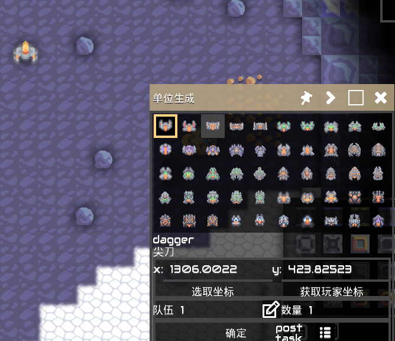

English|[中文](README.md)

# Mod Tools

A mod for mindustry v7.
It provides many useful tools for developers.

## ShowUIList

- Display `icon`, `tex`, `styles`, `colors`, `interps`

## Tester

- Provides `JS` code editor `Tester`

  - Press `Ctrl`+`Shift`+`Enter` to execute code immediately
  - Press `Ctrl`+`Shift`+`↑/↓` to switch through history records
  - Press `Ctrl`+`Shift`+`D` to view detailed information
- Built-in `unsafe`, `lookup`
- Built-in `IntFunc` class (abbreviated as `$`)

  - Use `$.xxx` to represent basic data types (e.g., `$.void` represents `Void.TYPE`; `$.J` represents `long.class`)
  - `$p` represents `Packages`
- [JSFunc](src/modtools/utils/JSFunc.java)
- Long press on code in the favorites to add it to the startup items
  
-

## UnitSpawn

- Multiple team selection
- Supports spawning at specific points
- Displays `name` and `localizedName`
  

## Selection

- Selector
- Supports `Tile`, `Building`, `Bullet`, `Unit`
  

## ReviewElement

- Displays a list of elements, double-click to copy the element to a js variable
- Select untouchable elements.
- + Mobile: Touch screen with another finger to filter the current element.
  + Computer: Press ` F` to filter the current element.
- Press `i` on the element to display the details (Open the `ShowInfoWindow`).
  

## Window

- Press `Ctrl`+`Tab` to switch windows
- Press `Shift`+`F4` to close the current window

## ShowInfoWindow

- Use `'null` to represent the null string
- `Ctrl`+`F` Focus search field
