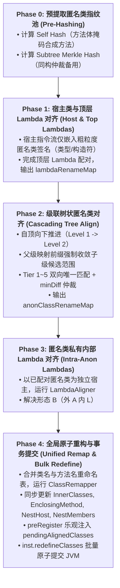
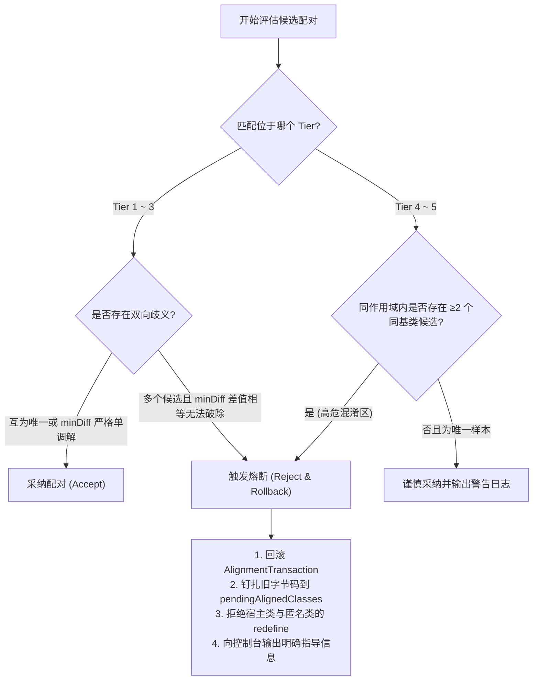

# 匿名内部类拓扑与混合嵌套对齐架构设计与开发计划
(Anonymous Class Cascading Tree Topology & Hybrid Closure Pipeline Plan)

> **版本**：v2.0 (RFC)  
> **状态**：已评审并整合核心架构与安全护栏  
> **目标运行时**：JDK 8 ~ 21 (基于 JBR-21 / DCEVM 增强类重定义)  
> **核心哲学**：**在热重载中，显式拒绝（Reject with Rollback）远胜于静默错配（Silent Misbinding）**。

---

## 一、背景与问题定义

在 Java 8+ 与 Kotlin 字节码热重载领域，**匿名内部类（Anonymous Inner Class）** 与 **Lambda 表达式** 的交织嵌套，被称为**“闭包嵌套终极难题”**。

在常规平铺场景中，匿名类是单层定义在宿主方法中的（如 `Foo$1`, `Foo$2`）。当前系统的 `AnonClassAligner` 基于结构内容哈希（`AnonClassHasher`）与双向 5 级多梯队（Tier 1~Tier 5）匹配，已能有效解决单层匿名类在增删调换时的序号漂移。

然而，在面对复杂多层嵌套与混合闭包时，缺乏树状拓扑会导致系统性缺陷：
1. **多层嵌套匿名类（`Foo$1$1`）的“层级打平”**：
   外层父类（如 `Foo$1`）位移后，未匹配的子匿名类若按扁平逻辑生成新类名（如 `Foo$3`），会强行打平 JVM 的 `InnerClasses` / `EnclosingMethod` 树状层级，破坏类加载结构与反射契约。
2. **同方法内同构子树的“跨树夺舍（Cross-tree Misbinding）”**：
   同一个宿主方法内创建两个结构相似的复合监听器（树 A: `Foo$1` 内部创建 `Foo$1$1`；树 B: `Foo$2` 内部创建 `Foo$2$1`）。若缺乏层级护栏，一旦外层或内层发生改动，树 A 的父可能被绑定到树 B 的子，造成运行时监听器执行错乱。
3. **Lambda 与匿名类的“混合嵌套（Hybrid Nesting）”**：
   * **形态 A（外 Lambda 内匿名类）**：`() -> new Runnable() { ... }`，宿主方法为 `lambda$foo$0`，内含 `NEW Foo$1`。
   * **形态 B（外匿名类内 Lambda）**：`new Runnable() { void run() { list.forEach(x -> ...); } }`，Lambda 为 `Foo$1.lambda$run$0`。
   外层对齐需要内层指纹，内层对齐又依赖外层方法名，存在循环依赖假象。

---

## 二、为什么不能直接照搬 `LambdaAligner`？

`LambdaAligner` 拥有成熟的 `shape`、`upDepth`、`hasUnmatchedChild` 和自底向上定稿机制，但两者的底层物理模型存在四个根本性冲突：

| 冲突维度 | Lambda 表达式（`LambdaAligner`） | 匿名内部类（`AnonClassAligner`） | 架构差异根因与设计决策 |
| :--- | :--- | :--- | :--- |
| **推进方向** | **自底向上（Bottom-up，父等子）** | **自顶向下（Top-down，前缀级联）** | 二级匿名类物理名为 `Foo$1$1`。若外层父类从 `Foo$1` 变为 `Foo$2`，子类物理前缀必须先变更为 `Foo$2$*`。若子先配对，连目标前缀都无法确定。 |
| **引用关系** | **单向无环图（DAG）** | **双向强引用环（Bi-directional Loop）** | 外层创建内层（`new Foo$1(this)`），内层字节码不仅有 `EnclosingMethod`，字段中还强制持有 `this$0` 强引用外层实例。 |
| **物理形态** | **单类方法表内部闭环** | **磁盘离散独立 Class 文件** | Lambda 全在宿主类的 `methods` 数组中，内存闭环；匿名类是多个独立 `.class` 文件，必须以多类原子事务包推进。 |
| **保留成本与风险** | **极低（注入空方法桩）** | **高（旧实例方法表与插槽占用）** | 被删除的旧匿名类字节码无需合成新类，原样保留在 JVM 即可；但必须严格**冻结旧编号槽位**，防止新生类抢占旧槽位导致老实例方法表被篡改。 |

---

## 三、类名分类学与准入过滤层（Taxonomy & Admission Rules）

在基于类名 `$` 解析层级树之前，必须建立严格的**分类准入过滤器**，避免误伤具名内部类、枚举切换类和 Kotlin 编译器特殊类：

```
                全量以 hostClassName + "$" 开头的类
                               │
       ┌───────────────────────┴───────────────────────┐
       ▼                                               ▼
[排除集：非不稳定匿名类]                     [准入集：候选匿名类]
1. 具名内部类：Foo$Inner                     1. 一级匿名类：Foo$1
2. 局部具名类：Foo$1Local                   2. 嵌套匿名类：Foo$1$1
3. 枚举映射表：Foo$1 (switch map)            3. 具名内部类下的匿名类：
4. Kotlin 特殊：Foo$WhenMappings,               Foo$Inner$1 (其父级为 Inner，
   Foo$$inlined$sam$...                         父路径冻结，只对齐末段 $1)
```

### 准入与识别规范表：
| 类名形态 | 判定规则 | 准入策略 | 级联树归属与前缀规则 |
| :--- | :--- | :--- | :--- |
| **标准一级匿名类** | 末段为纯数字（如 `Foo$1`） | **准入** | Level 1 节点，父为 `Foo` |
| **多层嵌套匿名类** | 各级 `$` 后均为纯数字（如 `Foo$1$2`） | **准入** | Level 2 节点，父为 `Foo$1` |
| **具名内部类下的匿名类** | 前缀含具名内部类（如 `Foo$Inner$1`） | **准入（局部）** | 父前缀 `Foo$Inner` 绝对冻结不可变，仅在该内部类分支下对齐 `$1` |
| **具名局部类** | 末段以数字开头但含非数字（`Foo$1Local`） | **排除** | 不参与重命名，字节码中保留原名 |
| **javac 枚举 Switch 映射表** | `Synthetic` + 继承 `Object` + 仅包含 `int[] $SwitchMap$...` 字段 | **排除（特殊）** | 判定为编译器合成缓存，分配固定专用映射，不参与常规匿名类匹配 |
| **Kotlin When 映射类** | 名字包含 `$WhenMappings` | **排除** | Kotlin 编译器专属查找表，不可篡改 |
| **枚举常量体** | 继承自该枚举类型且为 `final` | **排除** | 枚举常量体与常量序号严格绑定，重命名会导致 `Enum.valueOf` 崩溃 |

---

## 四、工业级五阶段协同流水线（The 5-Phase Hybrid Pipeline）

为解耦“外层 Lambda 对齐依赖内层匿名类指纹，内层匿名类对齐依赖外层 Lambda 方法名”的假性死锁，必须采用**严格串行推进**的五阶段流水线：



### 各阶段的核心关键点：

#### 1. Phase 0：无状态预哈希与伪循环消除
* **形态 B 内部 Lambda 漂移防护**：在 `AnonClassHasher` 扫描匿名类自身的方法表时，必须对以 `lambda$` 开头的合成方法名与描述符做统一掩码（替换为 `#SYNTHETIC_METHOD#` 与 `#SYNTHETIC_DESC#`），确保 Phase 0 算出的自身哈希不被其私有 Lambda 增删所干扰。
* **两级哈希分离**：
  * **自身结构哈希（Self Hash）**：仅由该匿名类自身的方法、字段、父类、接口与字节码计算，**不包含任何子匿名类的递归内容**。用于 Tier 1~3 的主匹配，确保“子匿名类方法体改动不会击穿父匿名类”。
  * **子树 Merkle 哈希（Subtree Hash）**：聚合子节点 Self Hash。仅当同构兄弟节点在 Tier 4/5 陷入位置差相等的极端歧义时，才调取子树哈希作为最终确定性判据。

#### 2. Phase 1：宿主类粗粒度指纹隔离
* **关键设计决策**：在宿主类扫描 `NEW Foo$1` 时，**严禁将匿名类的完整内容哈希 $H(A)$ 直接嵌入宿主票据**！因为开发者最频繁的操作就是“修改匿名类的方法体逻辑”。如果完整哈希进入宿主票据，每次改动匿名类都会导致外层宿主 Lambda 指纹全崩。
* **宿主票据格式**：
  ```text
  #ANON_RELID_COARSE(superName;interfaces;initDesc;capturedTypes)#
  ```
  宿主侧仅对匿名类的**类型接口与捕获入参**做指纹锚定，将完整逻辑内容的匹配完全留给 Phase 2。

#### 3. Phase 2：级联前缀收敛与多层推进
* **自顶向下级联**：
  1. 收集 Level 1 节点（所有直接子匿名类），运行 Tier 1~5 匹配，得到 Level 1 映射（如 `Foo$1 -> Foo$2`）。
  2. 针对 Level 2 节点：旧 `Foo$1$*` 的合法新候选**严格限制在 `Foo$2$*` 分支内**。
  3. 若父节点未匹配（被判定为新增或删除），其下属所有子节点直接归入未匹配集，禁止跨树抢占！
* **最小编号分配的全局避障域**：
  未匹配的新匿名类分配目标编号时，`takenTargetNames` 必须包含：
  1. 当前编译批次中所有已映射的目标名；
  2. 旧版本中已知存在的所有类名；
  3. **JVM 运行时当前已加载的所有历史类名与孤儿类名**（防止撞到尚未被 GC 卸载的已废弃类）。

#### 4. Phase 3：私有闭包自愈
* 遍历配对成功的一级与多级匿名类（如 `(Old: Foo$1, New: Foo$2)`），将其当作标准宿主，递归调用 `LambdaAligner.align(oldBytes, newBytes, oldResolver, newResolver)`。

#### 5. Phase 4：JVMS 属性同步与原子提交
* 通过 `ClassRemapper` 重写时，必须同步重写：
  * **`EnclosingMethod`**：指向重映射后的外层类名及外层宿主方法名。
  * **`InnerClasses`**：外层名称、内层名称与简单序号全部重构。
  * **`NestHost` 与 `NestMembers` (JDK 11+)**：更新嵌套宿主与成员列表，杜绝 `IllegalAccessError`。
* **事务乐观预登记**：在调用 `inst.redefineClasses` 之前，通过 `tx.preRegister()` 将未加载的新类字节码预写入 `AnnotationTransformer.pendingAlignedClasses`，消除宿主重定义完成后类加载器初次加载未对齐磁盘文件的竞态窗口。

---

## 五、匹配梯队判据矩阵与失败降级策略（Confidence Matrix & Fallback Policy）

### 1. 匹配梯队（Tier 1 ~ Tier 5）详细判据表
| 梯队 | 判定条件 | 置信度级别 | 适用场景 | 歧义处理原则 |
| :--- | :--- | :--- | :--- | :--- |
| **Tier 1** | **Self Hash 相同 + 宿主方法相同 + 描述符相同** | **极高 (Definite)** | 匿名类未改动，仅因外部同宿主 Lambda/类增删产生序号位移 | 双方互为唯一直接采纳；多对多按 minDiff 仲裁 |
| **Tier 2** | **Self Hash 相同（跨方法全局同构）** | **高 (High)** | 匿名类方法体未变，但宿主方法进行了内联或重构迁移 | 双向唯一采纳；若多候选需结合父类/接口进一步过滤 |
| **Tier 3** | **同宿主方法 + 同基类 + 同接口 + 同字段表 + 同声明方法签名** | **中 (Medium)** | 开发者编辑了匿名类内部的方法体实现，结构骨架保持不变 | 字段/方法严格匹配，防止将不同功能的监听器误配 |
| **Tier 4** | **同宿主方法 + 同基类 + 同接口** | **低 (Low)** | 开发者对匿名类增删了私有辅助方法或修改了捕获字段 | 仅当无冲突且同宿主下仅有唯一匹配对象时允许采纳 |
| **Tier 5** | **同物理类名（如 `Foo$1 == Foo$1`）+ 同基类接口** | **极低 (Fallback)** | 兜底保底策略，保住历史默认行为 | **只要存在任何同构竞品，坚决禁止采纳** |

---

### 2. 失败熔断与安全降级策略（Safety Fallback Policy）

> **安全核心契约**：在交互式热重载中，**宁可跳过本次重定义并提示开发者“检测到复杂层级变更，请保存重启”，也绝不允许把 Save 监听器静默重定义成 Delete 监听器！**



#### 降级执行动作规范：
1. **熔断条件**：
   * 在 Tier 4 / Tier 5 阶段，若同一宿主方法内存在多个同基类接口的匿名类，且无法获得结构证据支持；
   * 父级节点被判定为孤儿删除，但子级节点在新版本中仍被大量引用；
   * 类继承结构发生不可逆改变（`hierarchyChanged == true`）。
2. **熔断响应**：
   * 立即调用 `tx.rollback(true)`，清除预登记的 `pendingAdds`，并将旧版本字节码钉扎在 `pendingAlignedClasses` 中，防止类加载器读入磁盘错位版本。
   * 从本次批量重定义列表中剔除该宿主类及下属所有匿名类。
   * 控制台输出警示日志：
     ```text
     [HOTSWAP-REJECT] Structural ambiguity detected for anonymous classes in Foo.
     Candidate Foo$2 and Foo$3 are ambiguous in low-confidence tier.
     Hotswap safely skipped to prevent method hijacking. Please hot-swap again or restart application.
     ```

---

## 六、技术护栏落地现状与实施路线图

### 1. 基础护栏（已全部落地并实测 100% 验证）
* [x] **双向唯一校验（Bi-directional Uniqueness）**：彻底修复 `matchTier` 中的单向拔除缺陷，引入 `PAIR_COMPARATOR` 绝对确定性仲裁，实测正反遍历映射严格一致。
* [x] **调用者追溯 owner 强校验**：`findCallerMethod` 增加 `hostNode.name.equals(min.owner)` 与 `h.getOwner()` 比对，彻底杜绝外部工具类同名调用劫持。
* [x] **嵌套匿名类前缀截取**：未匹配类编号分配采用倒数第一个 `$` 前缀截取，保护 `Foo$1$1` 嵌套路径不被打平。
* [x] **乐观预登记闭环**：`tx.preRegister()` 在 `inst.redefineClasses` 前注入，消灭宿主重定义后首次加载未对齐类的竞态。

---

### 2. 下一阶段里程碑与蜕变测试（Milestones & Acceptance Criteria）

#### Milestone 2：级联树状对齐器核心实现
- [ ] **实现 `AnonClassAligner.alignCascading`**：按 `$` 深度驱动自顶向下迭代。
- [ ] **准入过滤器（Admission Filter）**：识别并放行标准匿名类与嵌套匿名类，排除具名内部类与 Kotlin 特殊类。
- [ ] **蜕变测试套件（Metamorphic Testing Suite）**：
  * **置换不变性（Permutation Invariance）**：对同一批输入匿名类集合进行随机 Shuffle、正序、反序遍历，断言输出的重命名表及重写字节码 100% 恒等。
  * **跨树隔离性（Cross-tree Isolation）**：构造树 A 与树 B 双同构树，修改树 A 子节点，断言树 B 父子配对绝对不受干扰，无跨树跳跃。
  * **增删自愈性（Add-Delete Healing）**：在 Level 1 中间插入新类，断言其下属多层嵌套子类全部自动同步偏移且层级结构完整。

#### Milestone 3：五阶段混合流水线打通与端到端实测
- [ ] **`HotSwapAgent` 协同流水线串联**：实现 Phase 0 ~ Phase 4 的完整状态机调度。
- [ ] **JVM 规范嵌套属性同步**：补齐 `NestHost` 与 `NestMembers` 重写支持。
- [ ] **真实 JBR-21 DCEVM 运行时验证**：在真实的 JVM 内存中验证混合嵌套热更后，旧实例回调、新实例回调与捕获状态均正常运作。

---

## 七、非目标与风险登记簿（Non-Goals & Risk Register）

### 非目标（Non-Goals）
1. **不保证跨宿主方法的匿名类跨树搬迁自愈**：若开发者将匿名类从 `methodA()` 剪切粘贴到 `methodB()`，系统将其视为“旧类删除 + 新类增加”，不尝试跨方法寻找历史旧实例进行跨树绑定（避免错误的生命周期与外部捕获污染）。
2. **不接管 Kotlin 编译器的 `inline fun` 展开类**：Kotlin 内联函数的跨文件展开由专有编译器插件机制处理，不在通用匿名类级联树中做深度重构。
3. **不支持动态类继承结构变更**：JVM 底层规范限制，增强重定义不支持修改父类与接口列表。

### 风险登记簿（Risk Register）
| 风险项 | 严重级 | 影响表现 | 缓解措施 |
| :--- | :--- | :--- | :--- |
| **置换环死锁** | 中 | `Foo$1 <-> Foo$2` 互换时若单类重定义会引发类名冲突 | 必须通过 `inst.redefineClasses` 批量原子提交；单类模式下打印高危告警 |
| **内存孤儿泄露** | 低 | 大量增删匿名类后旧未卸载类占用 Perm/Metaspace | 孤儿类保持无逻辑挂起，文档提示高频重构后择机重启开发环境 |
| **低置信度误判** | 高 | 业务逻辑发生静默漂移（例如 Save 串成 Delete） | 强制执行第五节的安全熔断策略，遇到歧义主动报错拒绝 |
