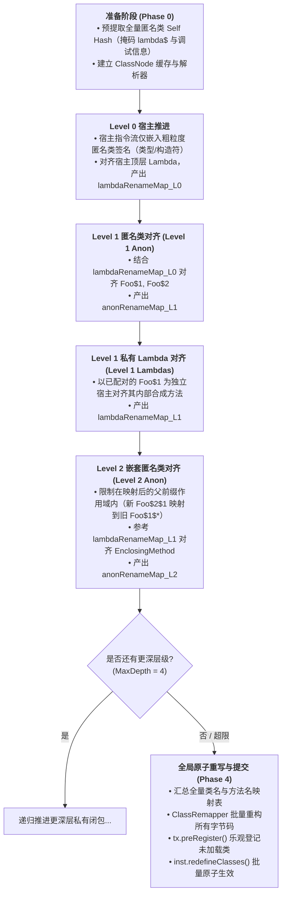

# 匿名内部类拓扑与混合嵌套对齐架构设计与开发计划 (v3.0)
(Anonymous Class Cascading Tree Topology & Hybrid Closure Pipeline Specification)

> **版本**：v3.0 (Comprehensive Engineering Specification)  
> **设计基准**：JDK 8 ~ 21 (基于 JBR-21 / DCEVM 增强类重定义机制)  
> **核心哲学**：**在类热重载中，显式拒绝并安全回滚（Reject & Rollback）远胜于隐式错配导致的方法篡改（Silent Misbinding）**。

---

## 一、系统目标、核心不变量与映射契约

### 1.1 系统目标与范围
本系统旨在解决在 JBR-21/DCEVM 增强类重定义下，由于源码编辑（增删、换序、捕获变量变更）导致匿名内部类（`Foo$N`）及 Lambda 表达式序号漂移时引发的**老实例方法表篡改（Hijacking）**与**类加载错位**问题。

* **支持范围**：
  * Java 源码编译器（javac 8, 11, 17, 21 与 ECJ）编译的标准类、一级匿名类、多层嵌套匿名类（`Foo$1$1`）以及 Lambda 混合嵌套。
  * 深度 $\le 4$ 的闭包混合嵌套结构。
* **非目标（Non-Goals）**：
  * **不保证跨方法的匿名类物理迁移自愈**：将匿名类从 `methodA` 剪切到 `methodB` 视为“旧类删除 + 新类新增”，不跨宿主方法篡夺老实例。
  * **不接管 Kotlin 编译器跨文件 `inline fun` 展开结构**：Kotlin 内联函数的跨文件重编不由本对齐器重新编织。
  * **不支持修改父类与接口列表**：JVM DCEVM 规范禁止修改已加载类的继承体系（`hierarchyChanged` 直接拒绝）。

### 1.2 核心不变量（Core Invariant）
> **物理身份稳定性不变量**：  
> **凡是在 JVM 中已经存在存活实例的已加载类（Loaded Class），其在运行时的方法表（vtable/itable）与字段物理布局必须严格保持历史语义连续性，绝对禁止被无关的新生类占用物理槽位。**

### 1.3 映射方向与重命名范围
* **映射方向**：
  $$\text{renameMap} : \text{新编译类名（New Name）} \longrightarrow \text{目标类名（Target Name）}$$
  * 若新类匹配到了 JVM 中已加载的旧类（如新 `Foo$2` 匹配老 `Foo$1`），则映射为旧类名 `Foo$1`。随后通过 `ClassRemapper` 将新字节码改名为 `Foo$1`，使 JVM `redefineClasses` 精准更新既有类。
  * 若新类为全新未匹配类，则分配一个未被占用的安全类名（`Foo$3`），通过 `pendingAlignedClasses` 在初次加载时拦截生效。
* **ClassRemapper 完整改写范围**：
  1. 指令流类型：`NEW`, `CHECKCAST`, `INSTANCEOF`, `MULTIANEWARRAY`
  2. 方法与字段：`INVOKESPECIAL`, `INVOKEVIRTUAL`, `INVOKESTATIC`, `INVOKEINTERFACE`, `GETFIELD`, `PUTFIELD`
  3. JVMS 类结构属性：`InnerClasses`, `EnclosingMethod`, `Signature`, 类注解与类型注解
  4. Java 11+ 嵌套特权属性：`NestHost`, `NestMembers`
  5. 校验元数据：`StackMapTable`（由 ASM 重新计算）
* **已知副作用与限制**：
  * 字符串常量（如 `Class.forName("Foo$2")` 或硬编码日志）不会被字节码 Remapper 修改。
  * 未显式声明 `serialVersionUID` 的类，其默认哈希受类名影响，改名后与外部持久化反序列化可能不兼容（热更建议仅在开发期使用）。

---

## 二、类名分类学与准入过滤层（Taxonomy & Admission Rules）

在构建级联树之前，必须建立前置分类准入层，过滤非不稳定匿名类：

| 类名特征 | 判定规则 | 准入策略 | 级联树归属与前缀契约 |
| :--- | :--- | :--- | :--- |
| **标准一级匿名类** | 末段为纯数字（如 `com/Foo$1`） | **准入** | Level 1 节点，前缀为 `com/Foo` |
| **多层嵌套匿名类** | 各级 `$` 后均为纯数字（如 `com/Foo$1$2`） | **准入** | Level 2 节点，逻辑父为 `com/Foo$1` |
| **具名内部类下的匿名类** | 前缀含具名内部类（如 `com/Foo$Inner$1`） | **局部准入** | 父前缀 `com/Foo$Inner` 绝对冻结，仅在该具名分支内对齐末段 `$1` |
| **具名局部类（Local Class）** | 末段以数字开头但含非数字（如 `com/Foo$1Local`） | **排除** | 不参与对齐，保留原始类名 |
| **javac 枚举 Switch 映射表** | `ACC_SYNTHETIC` + 仅包含 `$SwitchMap$` 字段 | **排除（固定）** | 识别为编译器缓存，分配固定专用映射，不参与常规对齐 |
| **Kotlin When 映射类** | 名字包含 `$WhenMappings` | **排除** | Kotlin 编译器专属查找表，保持原样 |
| **枚举常量体** | 直接继承自封闭枚举类型且为 `final` | **排除** | 序号与枚举常量声明严格绑定，不可重命名 |

---

## 三、层级交错协同流水线（The Level-Interleaved Hybrid Pipeline）

针对多层混合嵌套（例如：`Foo` $\to$ 匿名类 `Foo$1` $\to$ 私有 Lambda `Foo$1.lambda$run$0` $\to$ 嵌套匿名类 `Foo$1$1`），线性流水线在深度 $\ge 2$ 时会陷入循环依赖。系统采用**按层级交错推进架构（Level-Interleaved Pipeline）**：



### 3.1 哈希输入的严密定义与伪循环消除
在 Phase 0 中，`AnonClassHasher` 计算**自身结构哈希（Self Hash）**的规范：
* **包含项**：
  1. 父类内部名与已排序的接口列表内部名；
  2. 非合成字段名、类型描述符与修饰符；
  3. 非合成方法的名称、描述符与归一化指令序列（操作码流、类型引用、常量池字面量）；
  4. 匿名类引用的相对槽位索引（`#ANON_relId#`）。
* **排除项（归一化屏蔽）**：
  1. **调试属性**：`LineNumberTable`, `LocalVariableTable`, `SourceFile`, `SourceDebugExtension` 全部剔除；
  2. **私有合成闭包**：所有以 `lambda$` 开头的方法名掩码为 `#SYNTHETIC_METHOD#`，其描述符掩码为 `#SYNTHETIC_DESC#`；
  3. **常量池绝对位置**：LDC 字符串与类型均转换为标准符号；
  4. **子匿名类内容**：**严禁包含子匿名类的方法体或递归哈希**（父子哈希解耦，保证子变动不破坏父）。

### 3.2 未匹配子类的前缀映射契约（已实测修复 A2）
未匹配的子匿名类分配目标类名时，前缀**必须取自映射后的父类名**：
```java
int lastDollar = n.name.lastIndexOf('$');
String prefix = lastDollar > 0 ? n.name.substring(0, lastDollar) : hostSlash;
// 关键契约：若父类已被重命名（例如新 Foo$2 映射回旧 Foo$1），
// 则子类前缀必须跟随映射为 Foo$1，生成 Foo$1$1，严禁生成在已废弃的 Foo$2$* 之下！
String mappedParent = renameMap.get(prefix);
if (mappedParent != null) {
    prefix = mappedParent;
}
```

### 3.3 宿主方法追溯的强校验与调用环防护（已实测修复 A5）
`findCallerMethod` 逆向追溯宿主调用者时：
1. **三要素联合比对**：强制校验 `hostNode.name.equals(owner)`、`calleeName.equals(name)` 以及 `calleeDesc.equals(desc)`，杜绝重载方法与外部第三方库同名方法劫持；
2. **死循环与深度截断**：`visited` 集合记录 `methodName + ":" + methodDesc`，硬编码最大追溯深度 $\text{depth} \le 32$。

---

## 四、匹配梯队矩阵与安全熔断策略（Confidence Matrix & Safety Policy）

### 4.1 匹配梯队判定矩阵
| 梯队 | 判定条件 | 置信度 | 歧义与平局仲裁规则 |
| :--- | :--- | :--- | :--- |
| **Tier 1** | **Self Hash 相同 + 宿主方法相同 + 描述符相同** | 极高 (0.99) | 双方互为唯一立即锁定；多对多通过 `PAIR_COMPARATOR` 数值 minDiff 仲裁 |
| **Tier 2** | **Self Hash 全局相同（跨宿主方法）** | 高 (0.85) | 仅当全类唯一且父类/接口一致时采纳；存在多个候选直接留给下级梯队 |
| **Tier 3** | **同宿主方法 + 同基类 + 同接口 + 同字段表 + 同声明方法表** | 中 (0.70) | 允许方法体编辑；必须字段与方法列表完全一致 |
| **Tier 4** | **同宿主方法 + 同基类 + 同接口** | 低 (0.40) | 宽松结构兜底；**若宿主方法内存在 $\ge 2$ 个同基类候选，直接拒绝采纳** |
| **Tier 5** | **同物理类名 + 同基类接口** | 极低 (0.20) | 原地保底；若同作用域有结构更优者，禁止采纳 |

### 4.2 `orderIndex` 数值排序与仲裁比较器
`orderIndex` 定义为类名最后一个 `$` 符号后的整数值（例如 `Foo$1$10` 的 `orderIndex = 10`）。比较器采用绝对无序依赖的稳定排序：
```java
private static final Comparator<CandidatePair> PAIR_COMPARATOR = (p1, p2) -> {
    int cmp = Integer.compare(p1.diff, p2.diff); // 相对序号差升序
    if (cmp != 0) return cmp;
    cmp = Integer.compare(p1.n.orderIndex, p2.n.orderIndex); // 新类数值序
    if (cmp != 0) return cmp;
    cmp = Integer.compare(p1.o.orderIndex, p2.o.orderIndex); // 旧类数值序
    if (cmp != 0) return cmp;
    cmp = p1.n.name.compareTo(p2.n.name); // 字符串字典序保底
    if (cmp != 0) return cmp;
    return p1.o.name.compareTo(p2.o.name);
};
```

### 4.3 失败安全熔断策略（Fail-Safe Policy）
遇到以下情况，系统坚决触发**安全熔断（Reject & Rollback）**：
1. **低置信度同构冲突**：在 Tier 4 / Tier 5 阶段，同一个宿主方法内存在多个同基类/接口的匿名类，且 `minDiff` 差值相等无法确定性区分；
2. **层级孤儿穿透**：父匿名类在源码中已被彻底删除，但其子类在外部仍存在大量调用；
3. **类继承结构变化**：检测到基类或接口列表发生变更（`hierarchyChanged == true`）。

**熔断处理流**：
1. 立即调用 `tx.rollback(true)`，从 `AnnotationTransformer.pendingAlignedClasses` 中拔除预注册项；
2. 将 `bytecodeCache` 中的历史生效字节码钉扎（Pin）到 pending 映射中，确保初次类加载不会加载磁盘覆盖后的新文件；
3. 丢弃当前类的 `ClassDefinition`，取消调用 `redefineClasses`；
4. 控制台输出显式指导日志，绝不强行执行错位配对。

---

## 五、端到端推演案例（End-to-End Walkthrough）

### 场景设定
宿主 `Foo.java`，外层插入新任务导致编号位移，同时内层嵌套新增子监听器：
* **老版本 (V1)**：
  * `Foo$1`: 任务 Save，包含内层 `Foo$1$1`（Worker A）
  * `Foo$2`: 任务 Delete
* **新版本 (V2 编译产物)**：
  * `Foo$1`: **[新增]** 任务 Audit
  * `Foo$2`: 任务 Save（由原 `$1` 位移而来），包含：
    * `Foo$2$1`: Worker A（原 `Foo$1$1`）
    * `Foo$2$2`: **[新增]** Worker B
  * `Foo$3`: 任务 Delete（由原 `$2` 位移而来）

### 算法推演过程：
```text
[Phase 0: 预哈希]
  计算各匿名类 Self Hash:
  H(Audit) = 0xA1, H(Save) = 0xB2, H(Delete) = 0xC3, H(WorkerA) = 0xD4, H(WorkerB) = 0xE5

[Level 1: 对齐一级匿名类]
  候选集：旧 [Foo$1, Foo$2]，新 [Foo$1, Foo$2, Foo$3]
  Tier 1 匹配：
    新 Foo$2 (H=0xB2) <---> 旧 Foo$1 (H=0xB2)  [Save 配对成功]
    新 Foo$3 (H=0xC3) <---> 旧 Foo$2 (H=0xC3)  [Delete 配对成功]
  未匹配类：
    新 Foo$1 (Audit) 未匹配。
    分配新编号：避开已加载旧名 Foo$1, Foo$2，分配目标名 Foo$3...
    由于新映射表占用了旧名：
    目标类名映射表 Level 1:
      新 Foo$2 -> 目标 Foo$1 (覆盖老实例)
      新 Foo$3 -> 目标 Foo$2 (覆盖老实例)
      新 Foo$1 -> 目标 Foo$3 (全新分配类名)

[Level 2: 对齐二级嵌套匿名类]
  作用域收敛：
    旧 Foo$1$* 对应的新分支锁定为新 Foo$2$*！
    旧集：[Foo$1$1] (Worker A)
    新集：[Foo$2$1 (Worker A), Foo$2$2 (Worker B)]
  Tier 1 匹配：
    新 Foo$2$1 (H=0xD4) <---> 旧 Foo$1$1 (H=0xD4)
    映射结果：新 Foo$2$1 -> 目标 Foo$1$1 (继承映射后父名前缀 Foo$1)
  未匹配子类分配 (A2 规则)：
    新 Foo$2$2 未匹配。其新父为 Foo$2，重映射后父名为 Foo$1。
    前缀取 prefix = "Foo$1"。
    最小可用编号为 Foo$1$2！
    映射结果：新 Foo$2$2 -> 目标 Foo$1$2

[Phase 4: 全局重写与原子重定义]
  最终全局映射表：
    Foo$2 -> Foo$1
    Foo$3 -> Foo$2
    Foo$1 -> Foo$3
    Foo$2$1 -> Foo$1$1
    Foo$2$2 -> Foo$1$2
  ClassRemapper 一次性批量重写所有字节码中的引用与 EnclosingMethod，
  tx.preRegister() 预登记未加载类 Foo$3 与 Foo$1$2，
  调用 inst.redefineClasses 批量更新 [Foo, Foo$1, Foo$2]，老实例完美自愈！
```

---

## 六、工程落地与运行时管理

### 6.1 多轮热重载基线管理（Baseline Management）
* **旧侧真理来源**：第 $N+1$ 轮热重载时的“旧侧字节码”，**绝对不能读磁盘历史文件，必须读自 `bytecodeCache`**（即第 $N$ 轮热重载后在 JVM 里实际生效的字节码形态）。
* **缓存生命周期**：
  * 应用启动与 Agent `premain` 加载时初始化；
  * 热重载成功时通过 `tx.commit()` 更新已生效类的字节码；
  * 重定义抛异常或触发安全熔断时，通过 `tx.rollback(true)` 回滚，维持上一轮健康基线不变。

### 6.2 线程局部状态与嵌套重入安全
* `MethodFingerprinter.setAnonHashes` 严格约束在 `align()` 的 `try-finally` 块中执行清理。
* 嵌套层级调用（Level 1 递归调用 Level 2）采用显式栈式上下文（Stack-scoped Context），内层执行完成后精准恢复外层父节点哈希表，防止状态覆盖。

### 6.3 编译器与语言版本矩阵
* **JDK 8**：支持 javac 8 生成的 `lambda$null$x` 虚拟宿主方法扫描与还原。
* **JDK 11+**：强制维护 `NestHost` 与 `NestMembers` 属性，保证私有方法互访权限。
* **JDK 18+**：支持无 `this$0` 字段的无捕获匿名类。
* **Kotlin (kotlinc)**：识别 `$WhenMappings` 等非匿名类，避免介入 Kotlin 内部查找表。

### 6.4 诊断日志与特性开关
提供精细的系统属性控制（生产环境默认开启安全模式）：
* `-Dnipx.anonAlign.debug=true`：输出每一级 Tier 配对细节与决策链。
* `-Dnipx.anonAlign.strict=true`：严格模式，遇到任何 Tier 4/5 歧义立即安全熔断。
* `-Dnipx.anonAlign.disabled=false`：总回退开关，关闭后退回原始单类顺序模式。

---

## 七、实施路线图与验收标准

### 里程碑规划：
- [x] **Milestone 1：底层单层护栏加固（已全部落地）**
  - 双向唯一匹配校验（消除顺序依赖）；
  - 调用者逆向追溯校验 `owner`、`desc` 与死循环截断；
  - 未匹配嵌套子类前缀截取（已支持基于重映射父名派生）；
  - 乐观预登记机制（消除初次类加载竞态）。
- [ ] **Milestone 2：级联树（Cascading Tree）核心引擎**
  - 实现 `AnonClassAligner.alignCascading`：支持 Level 1 $\to$ Level N 自顶向下推进；
  - 接入严密准入分类器；
  - 编写**蜕变测试套件（Metamorphic Testing）**。
- [ ] **Milestone 3：多层交错流水线与端到端集成**
  - 打通 Phase 0 ~ Phase 4 状态机；
  - 覆盖深度 $\ge 2$ 的 Lambda/匿名类混合嵌套场景；
  - 在真实 JBR-21 DCEVM 上运行蜕变验证。

### 蜕变测试（Metamorphic Testing）验收准则：
1. **置换恒等性（Permutation Invariance）**：输入类集合以随机序列打乱，输出结果与标准正序严格恒等。
2. **前缀不变量（Prefix Invariant）**：断言所有子类的目标类名必须以对应父类的目标类名作为前缀。
3. **老实例状态稳定性（State Retention）**：在 JBR-21 环境下热更前后，已分配实例的字段值与业务执行链路绝对不变。
