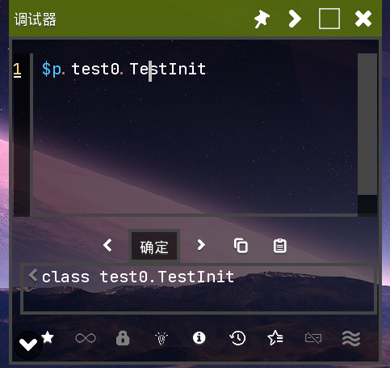

[English](index_en.md)|中文

## ShowUIList (UI列表)

- 显示 `icon` (图标)、`tex` (纹理)、`styles` (样式)、`colors` (颜色)、`interps` (插值器)\
  

## Tester (测试器)



- 提供 `JS` (JavaScript) 编辑器 `Tester` (测试器)
- 快捷键
  - 按 `Ctrl`+`Shift`+`Enter` 立即 `execute` (执行) 代码
  - 按 `Ctrl`+`Shift`+`↑/↓` 切换 `history` (历史) 记录
  - 按 `Ctrl`+`Shift`+`D` `view` (查看) 详细信息
  - 按 `Alt`+`V` 预览 `Texture` (纹理)
- 内置 `unsafe` (不安全操作)、`lookup` (查找)
- 内置 `IntFunc` 类 (别名为 `$`)

| 别名                                      | 对象/表达式                   | 描述                                              |
| ----------------------------------------- | ----------------------------- | ------------------------------------------------- |
| `IntFunc`                                 | `$`                           | -                                                 |
| `$p`                                      | Packages (包)                 | -                                                 |
| `$.J`, `$.I`, ...                         | long.class, int.class         | 基本类型的编码                                    |
| `$.long`<br/>`$.int`<br>...               | long.class, int.class         | -                                                 |
| `$.duo`, `$.copper`                       | Blocks.duo, Items.copper      | 按名称获取`UnlockableContent`内容                 |
| `$.items`, `$.liquids`, ...               | Items, Liquids, ...           | -                                                 |
| `$.item(name/id)`, `$.unit(name/id)`, ... | 具有该名称/id 的内容          | 按名称/id 获取内容                                |
| `$.forEach(list, func)`                   | `for (let v of list) { ... }` | Mindustry 的 RhinoJS 不支持 for-of 遍历 Java 对象 |
| `$.toArray(iterable)`                     | [...iterable]                 | 将一个对象转换为数组                              |
| `$.range(int)`, ... (类似 python)         | 一个生成器 (从 -> 到, 步长)   | 类似 Python                                       |
| `$.dialog(text/drawable/texture)`         | \_                            | 查看文本/可绘制对象/纹理                          |

- 代码: [JSFunc](https://github.com/i-hope1/mod-tools/src/modtools/utils/JSFunc.java)
- 在收藏夹中长按代码可添加到启动项\
  
- 快速切换历史记录\
  
- `$.item`、`$.liquid`、`$.unit` 等等。

## UnitSpawn (单位生成)

- 多队伍选择
- 支持定点生成
- 显示 `name` (名称) 和 `localizedName` (本地化名称)\
  
- 右键/长按名称标签可复制保存为 JS 变量。

## Selection (选择)

- 选择器
- 支持 `Tile` (地块)、`Building` (建筑)、`Bullet` (子弹)、`Unit` (单位)\
  

- 按 `Ctrl`+`Alt` 固定焦点窗口

## ReviewElement (审查元素)

- 显示元素列表，双击可将元素复制为 js 变量
- `Ctrl`+`Shift`+`C` 审查元素
- `Ctrl`+`Alt`+`D` 显示元素边界
- 选择不可触摸的元素
  - 移动端：用两根手指筛选当前元素
  - PC端：按 `F` 筛选当前元素
- 元素的功能快捷键
  - `i`：显示详情 (打开 ShowInfoWindow)
  - `p` (针对 Image)：显示 `DrawablePicker` (可绘制对象选择器)
  - `del`：(`shift` 可忽略确认)，删除元素
  - `<` / `>`：折叠 Group (组)
  - `f`：固定浮动的 Info (信息) 栏
  - `r`：调用元素的 method (方法)

- 

# Frag (碎片)

- 双击 Frag 的蓝色部分可最小化/恢复 Frag
- 在最小化状态下，点击蓝色部分，其行为将像一个悬浮球

## Window (窗口)

- 按 `Ctrl`+`Tab` 切换窗口
- 按 `Shift`+`F4` 关闭当前窗口
- 右键单击关闭按钮可移动和缩放窗口。

## ShowInfoWindow (显示信息窗口)

- `'null` 代表 `null` (空) 指针
- 按 `Ctrl`+`F` 聚焦搜索框
- 按 `Ctrl`+`Shift`+`F` 聚焦搜索框并清空搜索框

## Others (其他)

### Extensions (扩展)

- Override Scene (覆盖场景)

> 替换原始场景，捕获渲染错误，效果可能不佳

- Http Redirect (HTTP 重定向)

> 重定向某些网站，例如：github\
> 配置文件： b0kkihope/http_redirect.properties

# HotSwap (热交换)

> 热重载系统 · 字节码增强 · Lambda 对齐 · 实例追踪 · 性能分析

---

## 1. 系统概述

NipX HotSwap Agent 是一个基于 Java Instrumentation API 的 **热重载框架**。它利用 Java Agent 机制在运行时拦截类的加载和重定义事件，实现目标应用程序代码的零停机更新。整个系统围绕模块化设计构建，涵盖了字节码感知、差异检测、实例追踪和性能分析等多个维度。

### 1.1 核心能力

| 能力        | 关键类                   | 描述                                     |
| ----------- | ------------------------ | ---------------------------------------- |
| 热重载调度  | `HotSwapAgent`           | 监控文件变化并驱动整个重载流程           |
| 字节码增强  | `MyClassFileTransformer` | 在类加载期间注入追踪和性能分析代码       |
| 差异检测    | `ClassDiffUtil`          | 精确比较新旧类的结构以决定重载策略       |
| Lambda 对齐 | `LambdaAligner`          | 解决热交换过程中合成方法名称不匹配的问题 |

### 1.2 模块结构

| 类名                     | 职责                                                                                           |
| ------------------------ | ---------------------------------------------------------------------------------------------- |
| `HotSwapAgent`           | Agent 入口点、文件监控、重载调度，是类重定义的核心驱动                                         |
| `MyClassFileTransformer` | `ClassFileTransformer` 的实现，负责在类加载时注入 `@Tracker` 和 `@Profile` 代码                |
| `ClassDiffUtil`          | 基于 ASM 的字节码级差异分析工具，用于比较字段和方法的增、删、改，识别结构性变化                |
| `LambdaAligner`          | Lambda/合成方法名称的对齐器，使用哈希指纹在新旧方法名之间建立映射，以防止 `NoSuchMethodError`  |
| `MethodFingerprinter`    | 方法指纹计算器，使用 CRC64 对字节码指令流进行哈希，忽略匿名类名等不稳定因素                    |
| `InstanceTracker`        | 存活实例追踪器，使用 `WeakHashMap` 记录所有被 `@Tracker` 注解的类的实例                        |
| `MountManager`           | Classpath 挂载管理器，将监视目录以最高优先级注入到目标 ClassLoader 的 UCP 中，从而能够加载新类 |
| `Reflect`                | 反射工具类，通过 `jdk.internal.misc.Unsafe` 和 `IMPL_LOOKUP` 提供低级别的类定义能力            |

---

## 2. 注解使用指南

系统提供 4 个注解作为用户的核心 API。通过在业务代码上添加这些注解，可以在没有任何侵入性代码更改的情况下激活追踪、分析和重载等功能。

| 注解          | 目标     | 描述                                                                                                                                         |
| ------------- | -------- | -------------------------------------------------------------------------------------------------------------------------------------------- |
| `@Reloadable` | 类级别   | 标记该类被纳入热重载流程。当系统检测到该类的 `.class` 文件发生变化时，将执行精确的字节码比较和重定义。                                       |
| `@Tracker`    | 类级别   | 启用实例追踪。在字节码增强阶段，系统会向该类的所有 `<init>` 构造函数中注入对 `InstanceTracker.register(this)` 的调用，以记录每个存活的实例。 |
| `@Profile`    | 方法级别 | 启用方法级的性能分析。在字节码增强期间，系统会在方法入口记录 `nanoTime()` 并在出口计算经过的时间，然后报告给 `ProfilerData.record()`。       |
| `@OnReload`   | 方法级别 | 声明一个热重载回调。在其宿主类成功热重载后，系统将反射性地调用标有此注解的方法，用于执行刷新缓存或重新绑定状态等重载后操作。                 |

### 2.1 @Tracker — 实例追踪

用 `@Tracker` 注解一个类，Agent 将在启动时增强其字节码，在每次实例化时自动调用 `InstanceTracker.register()`。结合 `InstanceTracker.getInstances()`，您可以在运行时获取所有存活实例，这通常用于在热重载后批量刷新实例状态。

```java
import nipx.annotation.Tracker;

@Tracker
public class MyService {
    private String config;

    public MyService(String config) {
        // 由 Agent 自动注入: InstanceTracker.register(this)
        this.config = config;
    }
}

// 热重载后刷新所有存活实例
List<Object> instances = InstanceTracker.getInstances(MyService.class);
instances.forEach(obj -> ((MyService) obj).reloadConfig());
```

### 2.2 @Profile — 性能分析

将 `@Profile` 添加到任何需要监控的方法上，Agent 将在字节码层面注入计时代码。请注意：

- `@Profile` 是一个 **方法级** 注解，允许精确控制分析范围。
- 分析数据通过 `ProfilerData.record(String, long)` 异步报告，不会阻塞业务逻辑。
- 统计数据包括每个方法的调用次数和累积执行时间，可以定期打印或导出。

```java
import nipx.annotation.Profile;

public class OrderService {

    @Profile
    public Order createOrder(String userId) {
        // 方法执行后，时长会自动报告给：
        // ProfilerData.record("com.example.OrderService.createOrder", duration)
        return new Order(userId);
    }

    @Profile
    public void cancelOrder(long orderId) {
        // 同样，此方法也会被分析。
    }
}
```

### 2.3 @OnReload — 重载回调

当一个类成功热重载时，系统会扫描该类及其当前存活的实例，并调用被 `@OnReload` 注解的方法。这用于在不重启实例的情况下刷新内部状态。

```java
import nipx.annotation.OnReload;
import nipx.annotation.Tracker;

@Tracker  // 必须与 @Tracker 一起使用以找到存活实例
public class CacheManager {
    private Map<String, Object> cache = new HashMap<>();

    @OnReload
    public void onHotReload() {
        // 热重载完成后自动调用
        cache.clear();
        System.out.println("热重载后缓存已清除");
    }
}
```

---

## 3. 工作原理

### 3.1 热重载流程

整个热重载过程分为以下串行阶段：

| 阶段     | 步骤                                | 描述                                                                               |
| -------- | ----------------------------------- | ---------------------------------------------------------------------------------- |
| ① 感知   | 文件系统变化监控                    | `WatchService` 监听 `.class` 文件的 `CREATE` / `MODIFY` 事件，支持并发监控多个目录 |
| ② 读取   | 字节码缓存更新                      | 读取新的 `.class` 文件，并将其与 `bytecodeCache` 中的旧版本一起发送到差异分析流程  |
| ③ 分析   | `ClassDiffUtil.diff()`              | 精确比较字段和方法的增、删、改，以确定是否需要 Lambda 对齐或是否存在结构性变化     |
| ④ 对齐   | `LambdaAligner.align()`             | 如果合成方法名发生变化，使用哈希指纹匹配重写新字节码中的方法名，以防止 `NSME`      |
| ⑤ 重定义 | `Instrumentation.redefineClasses()` | 使用 JVM Instrumentation API 将对齐后的字节码热交换到运行时                        |
| ⑥ 回调   | `@OnReload` 方法调用                | 通过 `InstanceTracker` 找到所有存活实例，并反射性地调用被 `@OnReload` 注解的方法   |

### 3.2 字节码增强

`MyClassFileTransformer` 在类首次加载时进行干预，使用 ASM 的 `AdviceAdapter` 在方法的入口/出口点插入探针代码。它采用“抢先退出”策略：如果检测到类没有任何目标注解，它会立即返回 `null`（不修改字节码），从而对不相关的类实现零性能开销。

```java
// 简化的增强逻辑
if (hasClassAnnotation(bytes, Tracker.class)) {
    bytes = injectTracker(bytes, className, loader);
}
bytes = injectProfiler(bytes, className, loader);  // 方法级扫描
```

### 3.3 Lambda 对齐问题

对于每个 Lambda 表达式，Java 编译器会生成一个名为 `lambda$methodName$N` 的合成私有方法，其中 N 是一个内部编译器计数器。当方法体内的 Lambda 数量或顺序发生变化时，N 也会改变。这会导致 JVM 在热重载后抛出 `NoSuchMethodError`，因为它找不到相应的 BootstrapMethod。

`LambdaAligner` 用两步算法解决了这个问题：

1.  **第一步 (精确匹配)**：计算新旧版本中每个合成方法的 CRC64 指纹。如果指纹相同但名称不同，则创建一个名称重映射。
2.  **第二步 (顺序对齐)**：对于指纹不匹配的方法（由于逻辑更改），根据它们在文件中出现的顺序强制对齐，以保持调用链的完整性。

### 3.4 Classpath 挂载

当一个全新的类出现在监视目录中时，目标 `ClassLoader` 的 `URLClassPath` (UCP) 不包含此目录，因此无法加载新类。`MountManager` 使用反射访问 UCP 的内部字段，并将监视目录以最高优先级插入到 `path`、`unopenedUrls` 和 `loaders` 列表中。这确保了后续的类查找可以找到新的类文件。

> **注意**：挂载操作只执行一次（内部处理了去重）。挂载后，目标目录内的所有类文件对该 `ClassLoader` 可见，并且优先级高于原始的 Jar 文件，因此可以覆盖旧版本的类。

---

## 4. 配置与启动

### 4.1 Agent 启动参数

(`mod-tools` 在启用时会自动加载 agent。)
使用 JVM 启动参数将 Agent Jar 附加到目标进程，无需修改任何业务代码：

```bash
# 基本附加 (监视单个目录)
java -javaagent:nipx-agent.jar=watchDir=/path/to/classes \
     -XX:+EnableDynamicAgentLoading \
     -jar your-app.jar

# 监控多个目录 (逗号分隔)
java -javaagent:nipx-agent.jar=watchDir=/mod1/classes,/mod2/classes \
     -jar your-app.jar

# 调试模式 (将 .class 文件写入本地磁盘)
java -javaagent:nipx-agent.jar=watchDir=/path/to/classes,debug=true \
     -jar your-app.jar
```

### 4.2 运行时开关

`HotSwapAgent` 维护以下静态开关，可以根据需要在 Agent 代码中进行调整：

| 字段                   | 默认值  | 用途                                                              |
| ---------------------- | ------- | ----------------------------------------------------------------- |
| `ENABLE_HOTSWAP_EVENT` | `true`  | 主开关。如果为 `false`，Transformer 将不执行任何注入逻辑。        |
| `DEBUG`                | `false` | 调试模式。如果为 `true`，增强后的字节码将被写入本地文件以供分析。 |

### 4.3 类黑名单

您可以通过调用 `HotSwapAgent.addBlacklist(String prefix)` 将不应处理的类的包前缀添加到黑名单中。这使得 Transformer 直接跳过这些类，避免了不必要的字节码分析开销：

```java
// 在 premain 中或在运行时动态添加
HotSwapAgent.addBlacklist("com.thirdparty.legacy");
HotSwapAgent.addBlacklist("org.springframework.cglib");
```

---

## 5. 差异检测详解

### 5.1 `diff()` 方法

`ClassDiffUtil.diff(byte[] oldBytes, byte[] newBytes)` 是差异分析的入口点。它返回一个包含以下信息的 `ClassDiff` 对象：

| 字段                  | 含义                                                |
| --------------------- | --------------------------------------------------- |
| `modifiedBodyMethods` | 方法体被修改的方法列表 (方法名 + 描述符)            |
| `addedMethods`        | 新增方法列表                                        |
| `removedMethods`      | 已删除方法列表                                      |
| `changedFields`       | 字段变更，格式为 `"+ fieldName"` 或 `"- fieldName"` |
| `hierarchyChanged`    | 父类或接口是否已更改 (布尔值)                       |
| `errors`              | 严重不兼容变更的错误消息列表                        |

### 5.2 结构性 vs. 非结构性变更

系统将变更分为两类，并采用不同的处理策略：

**结构性变更** (`structureChanged() = true`)：

- 添加新方法或字段
- 删除方法或字段
- 父类/接口的变更 (`hierarchyChanged`)
- → 标准 JVM Instrumentation 不支持。需要 DCEVM/HotswapJVM 或用户重启。

**非结构性变更** (仅方法体变更)：

- 方法体逻辑的修改
- 常量值的更改
- 控制流的调整
- → 可以使用 `redefineClasses()` 直接热交换，无需重启。

### 5.3 方法指纹算法

`MethodFingerprinter` 遍历方法的 ASM 指令流，将每条指令的操作码、操作数和引用目标都纳入 CRC64 哈希计算。为了提高重载兼容性，以下内容被刻意忽略：

- 行号和局部变量表 (调试信息)
- `lambda$xxx$N` 中的数字后缀 `N` (一个内部编译器计数器，由 `LambdaAligner` 统一处理)
- 匿名内部类 / Kotlin Lambda 类名称中的随机数 (替换为 `#ANON_N#` 占位符)

---

## 6. 常见问题解答

### Q1: 我修改了代码，但热重载没有生效。为什么？

请检查以下几点：

- 确认 `.class` 文件确实被写入了受监控的 `watchDir` 目录 (您的 IDE 可能将其输出到不同的路径)。
- 确保 `ENABLE_HOTSWAP_EVENT` 为 `true`。
- 如果您添加了新方法或字段，标准 JVM 不支持这种热交换。您需要一个扩展的 JVM，如 DCEVM/HotswapJVM。
- 检查 `HotSwapAgent.info()` 日志中的 `[DIFF]` 输出，以确认差异检测是否被触发。

### Q2: 热重载后我收到了 `NoSuchMethodError`。如何修复？

这是一个 Lambda 名称漂移问题。确认在重定义过程中 `LambdaAligner` 已被调用。如果问题仍然存在，您可以启用 `DEBUG=true`，这会将增强后的字节码写入磁盘。使用 `javap -c` 比较新旧版本的 `BootstrapMethods` 属性，以找出未对齐的方法名。

### Q3: 如果 `@Tracker` 注入的代码的 `ClassLoader` 与 Agent 自己的 `ClassLoader` 不同怎么办？

`InstanceTracker` 类需要对目标类的 `ClassLoader` 可见。如果 Agent Jar 在 `BootClassLoader` 中，而目标类在 `AppClassLoader` 中，您可以将 `InstanceTracker` 添加到 `-Xbootclasspath/a` 或使用 `Instrumentation.appendToBootstrapClassLoaderSearch()` 将其附加到引导类路径。

### Q4: 如何查看 `@Profile` 收集的性能数据？

`ProfilerData.record()` 在内存中累积数据。您可以通过以下方式读取它：

```java
// 打印所有收集到的方法的执行时间统计
ProfilerData.printAll();

// 获取特定方法的统计对象
ProfilerData.Stats stats = ProfilerData.get("com.example.MyClass.myMethod");
System.out.println("avg: " + stats.avgNanos() + "ns, count: " + stats.count());
```

### Q5: 系统如何处理继承层次结构的变化？

`ClassDiffUtil` 会将此变更标记为 `hierarchyChanged = true`，并在 `errors` 列表中记录一个类似 `"! CRITICAL: Superclass changed"` 的错误。默认情况下，系统不会对继承关系已改变的类执行 `redefineClasses`（因为这在 JVM 层面不受支持）。它会记录一条警告，提示用户重启应用程序。

---

## 7. 高级用法

### 7.1 手动触发重载

除了通过文件监控自动触发外，您还可以通过编程方式为特定类触发重载：

```java
// 读取新的字节码并手动触发重载
byte[] newBytes = Files.readAllBytes(Path.of("/path/to/MyClass.class"));
HotSwapAgent.redefineClass(MyClass.class, newBytes);
```

### 7.2 扩展 `ProfilerData` 存储后端

默认情况下，`ProfilerData` 将统计信息存储在 `ConcurrentHashMap` 中。如果您需要将数据推送到像 Prometheus 或 InfluxDB 这样的监控后端，您可以扩展 `ProfilerData` 并覆盖 `record(String, long)` 方法，或者使用一个周期性任务来读取并批量上传数据。

### 7.3 自定义黑名单策略

`isBlacklisted()` 的默认实现使用前缀匹配。如果您需要更复杂的过滤（例如，正则表达式、包含关系），您可以修改 `HotSwapAgent` 中的逻辑或提供一个自定义的 `Predicate<String>` 注入到系统中。

> **提示**：建议仅在性能测试或诊断阶段在生产环境中使用 `@Profile`。诊断完成后，移除注解并重新部署，以消除字节码注入带来的微小性能开销。
