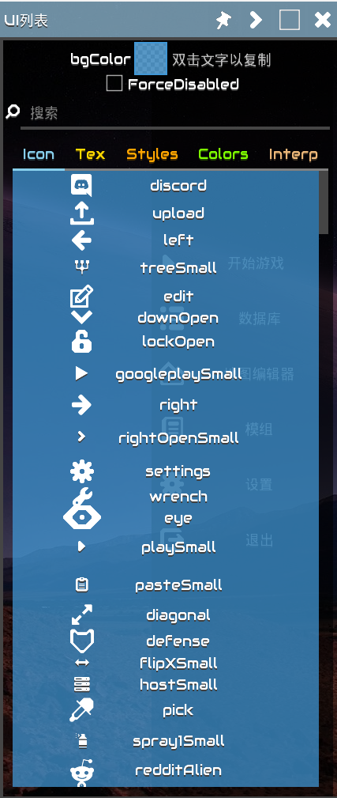
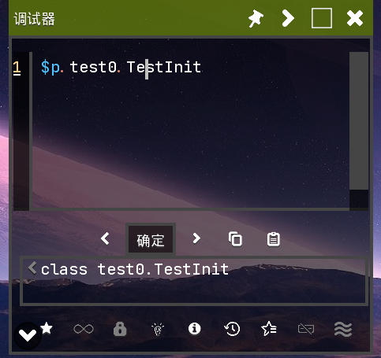
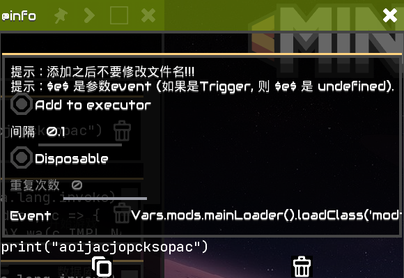
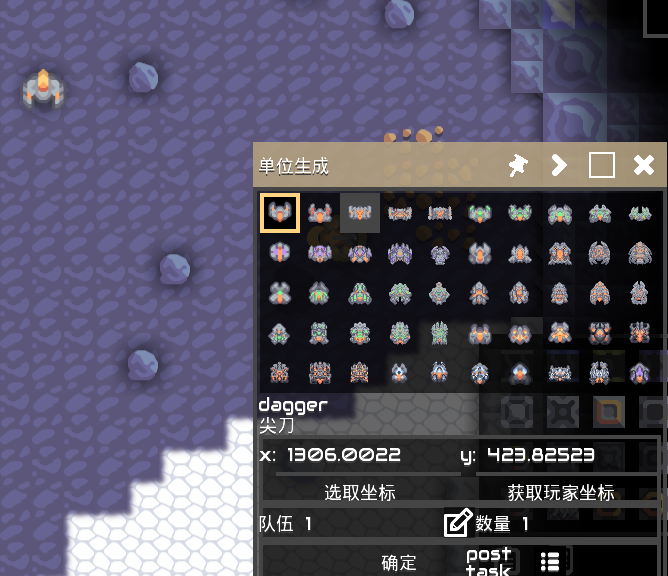
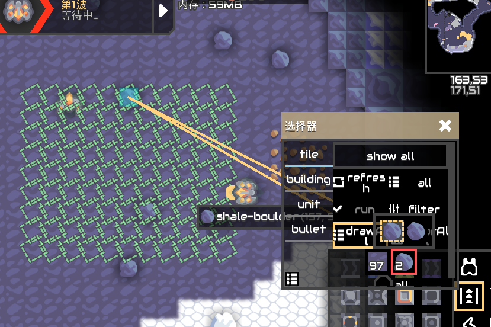
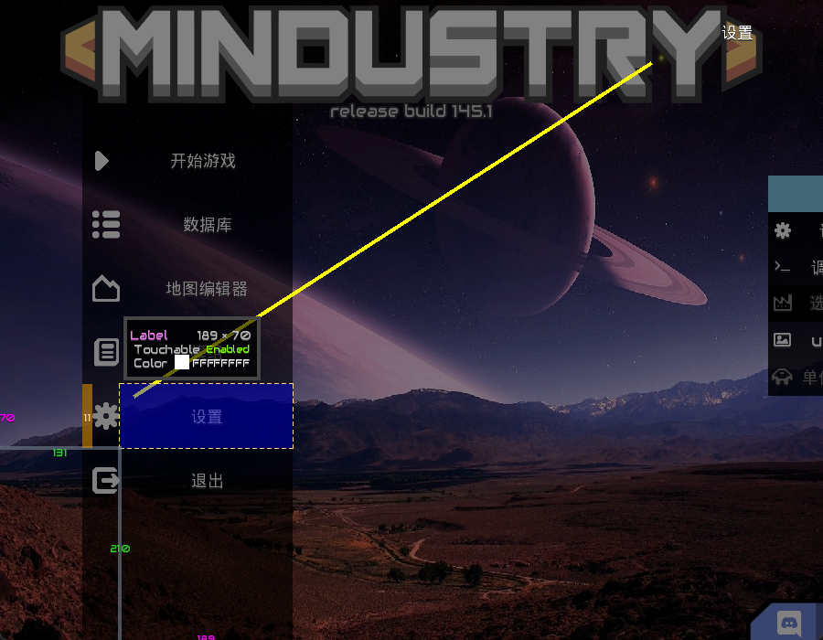

English|[中文](index.md)

## ShowUIList

- Display `icon`, `tex`, `styles`, `colors`, `interps`\

## Tester

- Provide `JS` editor `Tester`
- - Press `Ctrl`+`Shift`+`Enter` to `execute` code immediately
- - Press `Ctrl`+`Shift`+`↑/↓` to switch `history` records
- - Press `Ctrl`+`Shift`+`D` to `view` detailed information
- - Press `Alt`+`V` to preview `Texture`
- Built-in `unsafe`, `lookup`
- Built-in `IntFunc` class (abbreviated as `$`)
- + `$.xxx` can represent primitive data types (e.g., `$.void` represents `Void.TYPE`;`$.J` represents long.class)
- `$p` represents `Packages`
- Code: [JSFunc](https://github.com/i-hope1/mod-tools/src/modtools/utils/JSFunc.java)
- Long press on code in the favorites to add to startup items\

- Quick switch history\

## UnitSpawn

- Multiple team selection
- Support for fixed point spawning
- Display `name` and `localizedName`\

- 

## Selection
- Selector
- Supports `Tile`, `Building`, `Bullet`, `Unit`\

- Press `Ctrl`+`Alt` to fix Focus Window

## ReviewElement

- Display element list, double-click to copy element to js variable
- `Ctrl`+`Shift`+`C` to Inspect Element
- Select untouchable elements
- + Mobile: Filter current element with two fingers
  + PC: Press `F` to filter current element
- Press `i` on an element to display details (open ShowInfoWindow)\
- Press `del` on an element (`shift` hides confirmation), delete element
- Press `<` / `>` on an element to collapse Group

# Frag
- Double-click the blue part of Frag to minimize/restore Frag
- In the minimized state, click the blue part, it will behave like a floating ball

## Window

- Press `Ctrl`+`Tab` to switch windows
- Press `Shift`+`F4` to close current window
- RClick the close button to move and scl window.

## ShowInfoWindow

- `'null` represents null string
- Press `Ctrl`+`F` to focus search box
- Press `Ctrl`+`Shift`+`F` to focus search box and clear search box

## Others
### Extensions

- Override Scene
> Replace the original scene, capture rendering errors, may not be good

- Http Redirect
> Redirect some websites, such as: github\
> Configuration file: b0kkihope/http_redirect.properties
