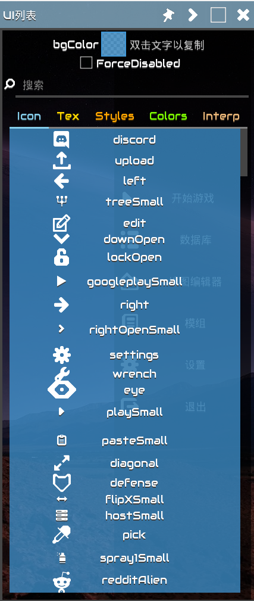
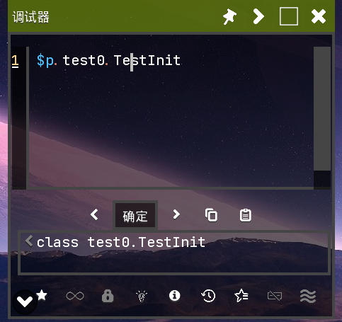
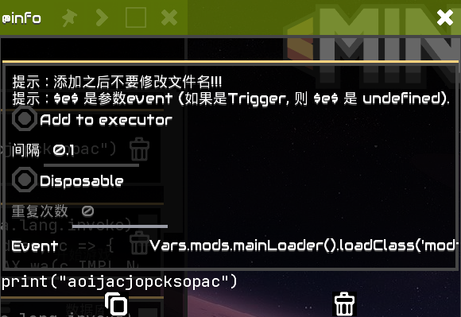
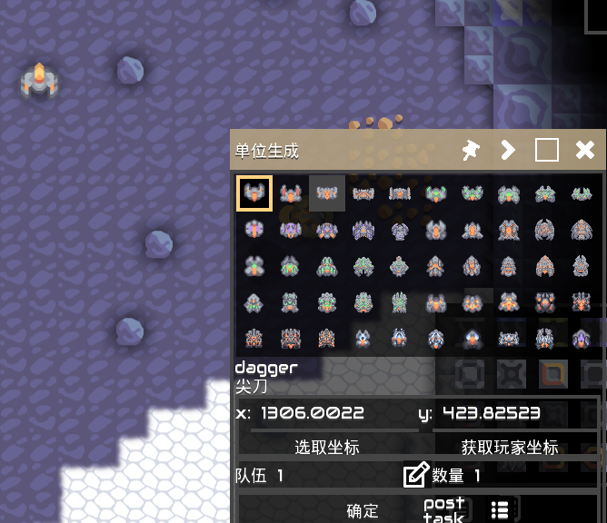

English|[中文](index.md)

## ShowUIList

- Display `icon`, `tex`, `styles`, `colors`, `interps`\

## Tester

- Provide `JS` editor `Tester`
- - `Ctrl`+`Shift`+`Enter` to execute code immediately
- - `Ctrl`+`Shift`+`↑/↓` to switch history
  - `Ctrl`+`Shift`+`D` to view detailed information
- Built-in `unsafe`, `lookup`
- Built-in `IntFunc` class (abbreviated as `$`)
- + `$.xxx` can represent basic data types (e.g. `$.void` represents `Void.TYPE`; `$.J` represents long.class)
- `$p` represents `Packages`
- [JSFunc](../src/modtools/utils/JSFunc.java)
- Long press on code in the favorites to add it to the startup items 
- Quickly switch history 

## UnitSpawn

- Multi-team selection
- Support for fixed-point generation
- Display `name` and `localizedName` 

## Selection
- Selector
- Support `Tile`, `Building`, `Bullet`, `Unit` 

- `Ctrl`+`Alt` fix Focus Window

## ReviewElement

- Display element list, double-click to copy element to js variable
- Select untouchable elements
- + Mobile: Filter current element with two fingers
  + Computer: Filter current element by pressing `F`
- Press `i` on the element to display details (open ShowInfoWindow) 

## Window

- `Ctrl`+`Tab` to switch windows
- `Shift`+`F4` to close the current window

## ShowInfoWindow

- `'null` represents null string
- `Ctrl`+`F` to focus on search box

## Others
### Extensions

- Override Scene
> Replace the original scene, capture rendering errors, may not be good

- Http Redirect
> Redirect some websites, such as: github\
> Configuration file: b0kkihope/http_redirect.properties
